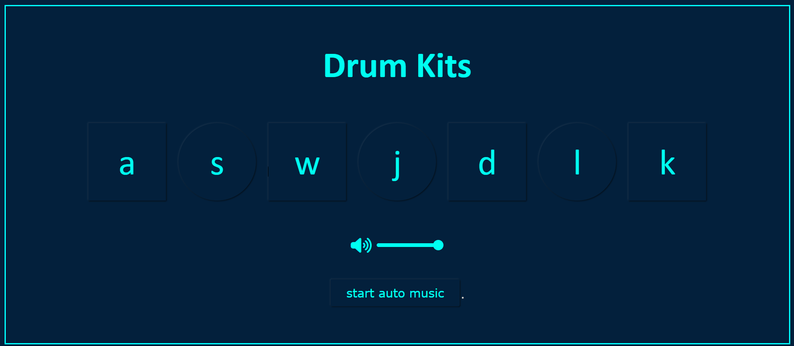
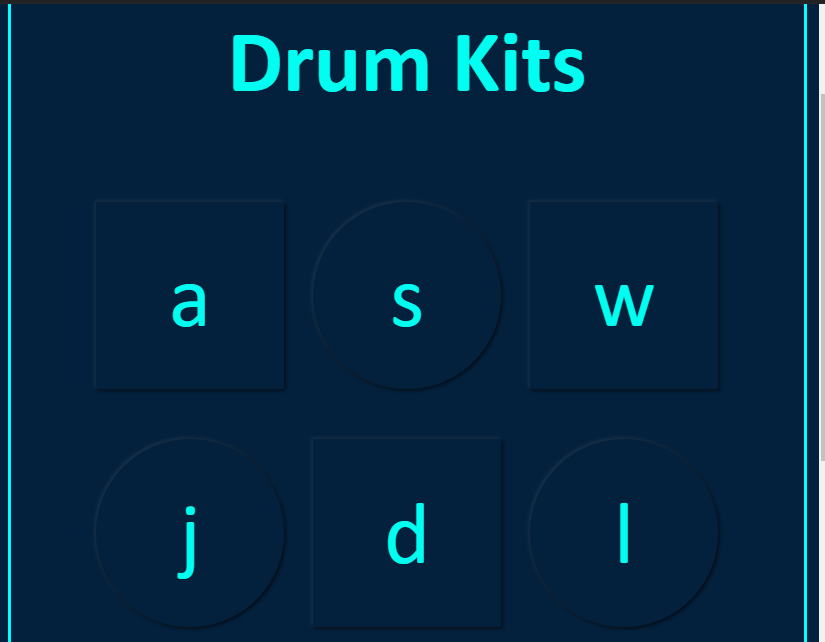
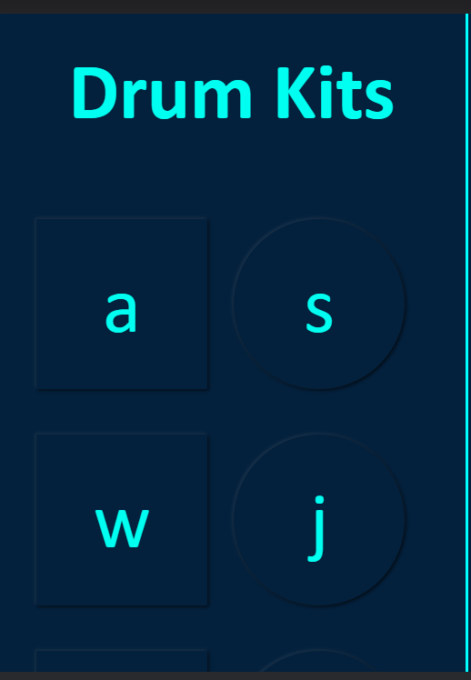

# Drum Kit
 ### I have created a Drum Kit with the help of HTML, CSS, and JavaScript.

 ### You can play auto music also.
 ### You can play the sound by your Keyboard also.

 

 
 

Live Link:- [Click here!](https://amarjeet-drum-kit.netlify.app/)

Picture of my project:-

## Technology Used:-
  - ` HTML ` 
  - ` CSS ` 
  - ` JS ` 

## What I learned from this project?
 - How I can play sound on-click of button. 
 - How I can play Auto music and also how I can stop it.
 - explore more about box shadow.
## It took almost 3 hours to complete.
  